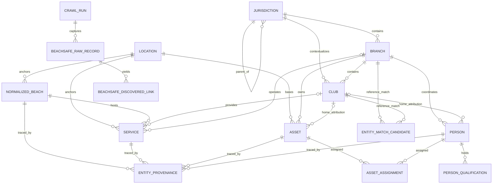

# Phase 1 System Design

## Document Status
- Status: Proposed
- Last updated: 2026-03-26
- Scope: Phase 1 descriptive baseline
- Related requirements: [`docs/requirements.md`](/Users/bonj/Developer/Elm/sls-data-analysis/docs/requirements.md)
- Related decisions: [`docs/decision-queue.md`](/Users/bonj/Developer/Elm/sls-data-analysis/docs/decision-queue.md)
- Related methodology: [`docs/methodology-register.md`](/Users/bonj/Developer/Elm/sls-data-analysis/docs/methodology-register.md)

## Purpose
Define the first concrete system design for:
- national/state/branch/club reference structure
- Beachsafe crawl and normalization
- coverage reconciliation
- initial service, asset, and personnel data model
- traceability for methodology and assumptions

Phase 1 is intentionally descriptive and auditable. It shall prioritize:
- raw data preservation
- explicit normalization rules
- completeness reporting
- separation of observed, inferred, and unavailable values

## Phase 1 Boundary

### Included
- asserted reference hierarchy for Australia, states, NSW Metro/Country where defined, branches, and clubs
- Beachsafe crawl-based discovery from seed entities and neighbouring links
- normalization of beaches, services, schedules, and related discovered entities
- reconciliation between asserted directories and crawl-derived entities
- initial storage for Rescue Services assets and personnel where available
- map-ready locations and geometry references
- provenance and methodology traceability at row and output level

### Deferred
- member-home travel analysis
- catchment overlap modelling
- contextual benchmarking models
- visitation and incident modelling
- probabilistic club choice or accessibility scoring

## Design Drivers
- Use a stable reference hierarchy even when source systems disagree on names.
- Preserve source records verbatim before any normalization.
- Treat Beachsafe as a discovery source, not the sole authority for organisational structure.
- Make ambiguity first-class so unresolved mappings stay visible instead of being silently forced.
- Keep storage extensible enough for ABS, SurfGuard extracts, and later modelling phases.

## Phase 1 Recommendations From Open Decisions
- D002 Primary Geographic Unit: use SA2 as the initial strategic geography key for future joins, but do not block Phase 1 on full ABS ingestion.
- D003 First Implementation Slice: adopt asserted directories plus Beachsafe crawl/normalization plus coverage reconciliation as the first end-to-end slice.
- D004 NSW Metro / Country Definition: model NSW regional grouping as an optional reference layer with `classification_status` until an authoritative mapping is confirmed.
- D011 Rescue Services Data Source And Attribution: allow partial/manual seed ingests with completeness flags and separate attribution confidence from asset/person existence.

## Core Entity Model

### 1. Organisational Reference Entities

#### `jurisdiction`
Represents Australia, states, and optional derived regional groupings such as NSW Metro/Country.

Key fields:
- `jurisdiction_id`
- `jurisdiction_type` (`national`, `state`, `state_subregion`)
- `code`
- `name`
- `parent_jurisdiction_id`
- `classification_basis` (`authoritative`, `project_defined`, `unknown`)
- `classification_status` (`observed`, `inferred`, `unavailable`)

#### `branch`
Represents surf lifesaving branches as organisational units.

Key fields:
- `branch_id`
- `name`
- `short_name`
- `state_jurisdiction_id`
- `nsw_subregion_jurisdiction_id` nullable
- `status`
- `reference_source_id`

#### `club`
Represents clubs as the core comparison unit.

Key fields:
- `club_id`
- `name`
- `short_name`
- `branch_id`
- `state_jurisdiction_id`
- `status`
- `preferred_locality`
- `preferred_state`
- `home_beach_label` nullable
- `reference_source_id`

### 2. Place and Service Entities

#### `location`
Canonical geospatial point or polygon anchor used by beaches, clubs, and service sites.

Key fields:
- `location_id`
- `location_role` (`beach`, `club`, `service_site`, `asset_base`, `unknown`)
- `name`
- `latitude`
- `longitude`
- `geom_wkt` nullable
- `sa2_code` nullable
- `geocode_status` (`observed`, `derived`, `unavailable`)

#### `beachsafe_raw_record`
Immutable landing table for each fetched Beachsafe response.

Key fields:
- `raw_record_id`
- `crawl_run_id`
- `source_url`
- `source_entity_type`
- `source_entity_key`
- `fetched_at`
- `http_status`
- `payload_json`
- `payload_hash`

#### `beachsafe_discovered_link`
Stores graph edges discovered from Beachsafe payloads.

Key fields:
- `discovered_link_id`
- `crawl_run_id`
- `from_raw_record_id`
- `link_relation` (`neighbour`, `service`, `beach`, `club`, `other`)
- `target_source_key`
- `target_url`
- `follow_status`

#### `normalized_beach`
Canonical beach/place entity normalized from Beachsafe and later sources.

Key fields:
- `normalized_beach_id`
- `canonical_name`
- `state_jurisdiction_id`
- `location_id`
- `source_confidence`
- `normalization_status` (`matched`, `merged`, `ambiguous`, `unresolved`)

#### `service`
Canonical service provider/site record. This includes volunteer club patrol services, branch rescue services where represented as service points, ALS, council lifeguards, and unknown/provisional service entities.

Key fields:
- `service_id`
- `service_name`
- `service_type` (`club_patrol`, `branch_rescue`, `als`, `council_lifeguard`, `other_professional`, `unknown`)
- `service_model` (`volunteer`, `professional`, `mixed`, `unknown`)
- `normalized_beach_id` nullable
- `club_id` nullable
- `branch_id` nullable
- `location_id` nullable
- `operational_status`
- `observation_status` (`observed`, `inferred`, `unavailable`)

#### `service_schedule`
Observed schedule fragments extracted from Beachsafe or later sources.

Key fields:
- `service_schedule_id`
- `service_id`
- `source_record_id`
- `schedule_text_raw`
- `season_label` nullable
- `day_pattern` nullable
- `start_date` nullable
- `end_date` nullable
- `start_time` nullable
- `end_time` nullable
- `extraction_status` (`structured`, `partial`, `raw_only`)

### 3. Coverage and Mapping Entities

#### `entity_alias`
Known aliases for reference and normalized entities.

Key fields:
- `entity_alias_id`
- `entity_type`
- `entity_id`
- `alias_text`
- `alias_kind` (`official`, `source_name`, `normalized`, `manual`)
- `source_record_id` nullable

#### `entity_match_candidate`
Candidate links between asserted reference entities and discovered/normalized entities.

Key fields:
- `match_candidate_id`
- `reference_entity_type`
- `reference_entity_id`
- `candidate_entity_type`
- `candidate_entity_id`
- `match_method` (`exact_name`, `normalized_name`, `location_proximity`, `manual_review`)
- `match_score`
- `decision_status` (`accepted`, `rejected`, `pending`)

#### `coverage_reconciliation_result`
Materialized reconciliation result for reporting.

Key fields:
- `reconciliation_result_id`
- `reconciliation_run_id`
- `reference_entity_type`
- `reference_entity_id`
- `coverage_status` (`matched`, `missing_in_crawl`, `crawl_only`, `duplicate`, `ambiguous`)
- `matched_entity_type` nullable
- `matched_entity_id` nullable
- `reason_code`
- `notes`

### 4. Rescue Services Inventory Entities

#### `asset`
Tracks branch Rescue Services assets and other later operational assets.

Key fields:
- `asset_id`
- `asset_type` (`rwc`, `uav`, `do_vehicle`, `other`)
- `asset_name`
- `branch_id`
- `home_club_id` nullable
- `base_location_id` nullable
- `operational_status`
- `observation_status`
- `attribution_status` (`known`, `partial`, `unknown`)

#### `person`
Minimal person/entity record for operator attribution without assuming a full member master dataset.

Key fields:
- `person_id`
- `display_name`
- `person_type` (`member`, `staff`, `unknown`)
- `home_club_id` nullable
- `branch_id` nullable
- `observation_status`
- `attribution_status`

#### `person_qualification`
Observed capability flags.

Key fields:
- `person_qualification_id`
- `person_id`
- `qualification_type` (`rwc_operator`, `uav_operator`, `duty_officer`, `other`)
- `qualification_status`
- `valid_from` nullable
- `valid_to` nullable
- `source_record_id`

#### `asset_assignment`
Tracks current or historical linkage between assets and personnel where known.

Key fields:
- `asset_assignment_id`
- `asset_id`
- `person_id`
- `assignment_role`
- `start_date` nullable
- `end_date` nullable
- `source_record_id`

## Relationship Summary
- one `jurisdiction` has many child `jurisdiction`
- one `state` has many `branch`
- one `branch` has many `club`
- one `location` may be referenced by many `normalized_beach`, `service`, and `asset`
- one `normalized_beach` may have many `service`
- one `club` may map to zero or many `service`
- one `branch` may own many `asset` and many `person`
- one `club` may be the home attribution for many `asset` and many `person`
- one raw Beachsafe record may yield many discovered links, aliases, schedules, and match candidates

## High-Level ERD

The ERD is intentionally high level:
- it shows canonical tables and cardinality, not every nullable foreign key
- provenance, assumptions, and reporting tables remain described in the sections below
- reconciliation is shown from the reference side because that is the primary Phase 1 reporting path

## Layered ERD

```mermaid
flowchart TB
    subgraph RAW["Raw Layer"]
        RAW_CRAWL["raw.crawl_run"]
        RAW_BEACHSAFE["raw.beachsafe_raw_record"]
        RAW_LINK["raw.beachsafe_discovered_link"]
        RAW_DIRECTORY["raw.reference_directory_record"]
        RAW_RESCUE["raw.rescue_services_record"]
    end

    subgraph CORE["Core Layer"]
        CORE_JUR["core.jurisdiction"]
        CORE_BRANCH["core.branch"]
        CORE_CLUB["core.club"]
        CORE_LOC["core.location"]
        CORE_BEACH["core.normalized_beach"]
        CORE_SERVICE["core.service"]
        CORE_SCHEDULE["core.service_schedule"]
        CORE_ALIAS["core.entity_alias"]
        CORE_MATCH["core.entity_match_candidate"]
        CORE_PROV["core.entity_provenance"]
        CORE_ASSET["core.asset"]
        CORE_PERSON["core.person"]
        CORE_QUAL["core.person_qualification"]
        CORE_ASSIGN["core.asset_assignment"]
        CORE_ASSUME["core.assumption_register"]
        CORE_ASSUME_LINK["core.entity_assumption_link"]
    end

    subgraph REPORT["Report Layer"]
        REPORT_RUN["report.coverage_reconciliation_run"]
        REPORT_RECON["report.coverage_reconciliation_result"]
        REPORT_COMPLETE["report.completeness_summary"]
        REPORT_SERVICE["report.service_inventory_snapshot"]
        REPORT_ASSET["report.asset_personnel_snapshot"]
        REPORT_MAP["report.map_feature_export"]
    end

    RAW_CRAWL --> RAW_BEACHSAFE
    RAW_BEACHSAFE --> RAW_LINK

    RAW_DIRECTORY --> CORE_JUR
    RAW_DIRECTORY --> CORE_BRANCH
    RAW_DIRECTORY --> CORE_CLUB

    CORE_JUR --> CORE_BRANCH
    CORE_BRANCH --> CORE_CLUB

    RAW_BEACHSAFE --> CORE_BEACH
    RAW_BEACHSAFE --> CORE_SERVICE
    RAW_BEACHSAFE --> CORE_SCHEDULE
    CORE_LOC --> CORE_BEACH
    CORE_LOC --> CORE_SERVICE
    CORE_BEACH --> CORE_SERVICE

    RAW_RESCUE --> CORE_ASSET
    RAW_RESCUE --> CORE_PERSON
    RAW_RESCUE --> CORE_QUAL
    RAW_RESCUE --> CORE_ASSIGN
    CORE_BRANCH --> CORE_ASSET
    CORE_BRANCH --> CORE_PERSON
    CORE_CLUB --> CORE_ASSET
    CORE_CLUB --> CORE_PERSON
    CORE_PERSON --> CORE_QUAL
    CORE_ASSET --> CORE_ASSIGN
    CORE_PERSON --> CORE_ASSIGN

    CORE_ALIAS --> CORE_BRANCH
    CORE_ALIAS --> CORE_CLUB
    CORE_MATCH --> CORE_BRANCH
    CORE_MATCH --> CORE_CLUB
    CORE_PROV --> CORE_BEACH
    CORE_PROV --> CORE_SERVICE
    CORE_PROV --> CORE_ASSET
    CORE_PROV --> CORE_PERSON
    CORE_ASSUME --> CORE_ASSUME_LINK

    CORE_MATCH --> REPORT_RECON
    REPORT_RUN --> REPORT_RECON
    REPORT_RUN --> REPORT_COMPLETE
    CORE_SERVICE --> REPORT_SERVICE
    CORE_ASSET --> REPORT_ASSET
    CORE_PERSON --> REPORT_ASSET
    CORE_LOC --> REPORT_MAP
```

This view is for storage shape rather than strict relational notation:
- arrows show primary flow and dependency across layers
- `raw` captures landed evidence
- `core` holds canonical entities and traceability
- `report` holds run-scoped derived outputs

## Storage Shape

### Storage Pattern
Phase 1 should use a layered storage shape:
1. raw landing layer
2. normalized relational layer
3. reporting/materialized output layer

This keeps provenance intact while allowing deterministic rebuilds.

### Proposed Dataset / Schema Layout

#### Raw layer
- `raw.crawl_run`
- `raw.beachsafe_raw_record`
- `raw.beachsafe_discovered_link`
- `raw.reference_directory_record`
- `raw.rescue_services_record`

Characteristics:
- append-only
- immutable payload retention
- record-level source metadata
- deterministic hashing for de-duplication

#### Core normalized layer
- `core.jurisdiction`
- `core.branch`
- `core.club`
- `core.location`
- `core.normalized_beach`
- `core.service`
- `core.service_schedule`
- `core.asset`
- `core.person`
- `core.person_qualification`
- `core.asset_assignment`
- `core.entity_alias`
- `core.entity_match_candidate`

Characteristics:
- stable synthetic IDs
- nullable fields where coverage is incomplete
- explicit status fields instead of implicit null semantics

#### Reporting / audit layer
- `report.coverage_reconciliation_result`
- `report.completeness_summary`
- `report.service_inventory_snapshot`
- `report.asset_personnel_snapshot`
- `report.map_feature_export`

Characteristics:
- run-stamped snapshots
- safe to publish to analysts without exposing raw payload complexity
- derived only from raw plus core layers

## Data Flow

### 1. Reference Directory Ingestion
Input:
- asserted national/state/branch/club directory files

Flow:
1. load raw directory rows into `raw.reference_directory_record`
2. normalize jurisdictions, branches, and clubs into `core`
3. generate aliases from official names, short names, and known variants
4. mark unresolved hierarchy issues for review

Output:
- authoritative baseline for expected coverage

### 2. Beachsafe Crawl And Discovery
Input:
- seed Beachsafe URLs or IDs

Flow:
1. create `crawl_run`
2. fetch source payloads into `raw.beachsafe_raw_record`
3. parse neighbouring/service links into `raw.beachsafe_discovered_link`
4. follow unseen targets within scope
5. stop when no new in-scope targets remain or crawl limits are reached

Output:
- crawl graph
- raw payload archive
- discovered target inventory

### 3. Normalization
Flow:
1. extract candidate beaches, services, schedules, and coordinates from raw payloads
2. standardize names, locality tokens, and service type labels
3. create `normalized_beach`, `service`, and `service_schedule`
4. record aliases and source-to-canonical mappings
5. mark uncertain merges as `ambiguous` rather than forcing a single record

Rules:
- observed source values remain available alongside normalized values
- duplicate resolution must be rule-based and reviewable
- every canonical record must be traceable back to one or more source records

### 4. Coverage Reconciliation
Flow:
1. compare asserted branches/clubs against normalized discovered entities
2. compute candidate matches using name, alias, parent hierarchy, and location
3. classify each reference entity into matched, missing, ambiguous, or duplicate-related outcomes
4. materialize results into `report.coverage_reconciliation_result`

Output:
- completeness report
- manual review queue for unresolved records

### 5. Rescue Services Inventory Ingestion
Input:
- branch/state asset and personnel spreadsheets or manual seed data

Flow:
1. land raw records in `raw.rescue_services_record`
2. normalize assets, persons, qualifications, and assignments
3. attempt club attribution through reference club matching
4. keep unknown home-club attribution explicit

Output:
- initial cross-service contribution baseline

### 6. Map-Ready Exports
Flow:
1. emit canonical point/polygon rows for clubs, beaches, service sites, and asset bases
2. include source, status, and confidence attributes
3. produce one geometry export per reporting run

Output:
- analyst-ready map layers without reprocessing raw payloads

## Normalization And Reconciliation Logic

### Canonicalization Priorities
1. preserve source record
2. standardize naming and structure
3. link to asserted hierarchy if confidence is sufficient
4. surface ambiguity when confidence is not sufficient

### Matching Heuristics
- exact or normalized name equality
- alias match from curated synonym table
- shared parent branch or state context
- coordinate proximity where both sides have locations
- same beach/service relationship across multiple raw records

### Reconciliation Status Semantics
- `matched`: reference entity confidently linked to discovered normalized entity
- `missing_in_crawl`: expected from directory, not observed in crawl
- `crawl_only`: observed in crawl, absent from asserted directory
- `duplicate`: multiple source records appear to represent one operational entity
- `ambiguous`: plausible matches exist but cannot yet be resolved defensibly

### Observed / Inferred / Unavailable
- `observed`: directly stated by a source record
- `inferred`: derived by project logic, such as SA2 lookup from coordinates
- `unavailable`: required value not yet observed and not safely derivable

No Phase 1 output should collapse `unavailable` into zero, false, or absence.

## Traceability Design

### Row-Level Provenance
Every normalized record should be traceable to source rows through a mapping table:

#### `entity_provenance`
- `entity_provenance_id`
- `entity_type`
- `entity_id`
- `source_system` (`directory`, `beachsafe`, `rescue_services`, `manual`)
- `source_record_id`
- `derivation_step` (`ingest`, `normalize`, `match`, `manual_resolution`)
- `method_id`
- `assumption_set_id` nullable

### Method Traceability
- Phase 1 normalization and reconciliation shall reference methodology ID `M001`.
- Each material pipeline step should declare the method ID it implements.
- Design documents shall record rule families, assumptions, and known limitations.

### Assumption Traceability

#### `assumption_register`
- `assumption_id`
- `scope_area`
- `statement`
- `status` (`active`, `retired`, `superseded`)
- `source_document`
- `decision_id` nullable

#### `entity_assumption_link`
- `entity_type`
- `entity_id`
- `assumption_id`
- `link_reason`

Use cases:
- NSW Metro/Country mapping awaiting authoritative definition
- provisional service type classification where Beachsafe labels are inconsistent
- partial home-club attribution for Rescue Services operators

## Initial Output Contracts

### 1. Reference Directory Snapshot
One row per jurisdiction, branch, and club with:
- canonical IDs
- parent hierarchy
- alias coverage
- status fields

### 2. Coverage Reconciliation Report
One row per reference branch/club and crawl-only discovered entity with:
- status
- matched counterpart if any
- reason code
- manual review flag

### 3. Service Inventory
One row per canonical service with:
- service type/model
- linked beach, branch, club
- schedule coverage status
- provenance count

### 4. Rescue Services Inventory
One row per asset and one row per person with:
- branch ownership
- home-club attribution status
- qualification or role coverage
- source completeness notes

### 5. Map Feature Export
One geometry row per mappable entity with:
- canonical ID
- entity type
- geometry source
- confidence and observation status

## First Implementation Slices

### Slice 1: Reference Hierarchy Baseline
Deliver:
- `jurisdiction`, `branch`, `club`
- raw directory ingest
- alias support

Value:
- establishes the expected national structure
- unlocks all later reconciliation work

Exit criteria:
- every asserted club belongs to one branch and one state
- unresolved hierarchy defects reported explicitly

### Slice 2: Beachsafe Crawl Archive
Deliver:
- crawl runner
- raw payload storage
- discovered-link graph

Value:
- creates reproducible raw evidence
- supports crawl completeness diagnostics

Exit criteria:
- rerunnable crawl with deterministic run IDs and payload hashes
- discovered URLs/IDs captured without silent drops

### Slice 3: Beachsafe Normalization
Deliver:
- normalized beaches
- canonical services
- schedule extraction scaffold
- provenance mapping

Value:
- produces the first usable service inventory
- makes Beachsafe data queryable beyond raw JSON

Exit criteria:
- every canonical beach/service links back to raw source records
- ambiguous merges remain reviewable

### Slice 4: Coverage Reconciliation
Deliver:
- match candidates
- reconciliation result table
- completeness summary

Value:
- shows where asserted structure and observed crawl diverge
- identifies missing and duplicate entities early

Exit criteria:
- branch and club reconciliation can be run nationally
- output distinguishes matched, missing, crawl-only, duplicate, ambiguous

### Slice 5: Rescue Services Seed Inventory
Deliver:
- asset, person, qualification, assignment tables
- raw-to-core normalization
- club attribution status reporting

Value:
- establishes the cross-service data model before full source maturity
- avoids redesign when richer branch data arrives

Exit criteria:
- can ingest partial branch data without schema change
- unknown attribution remains explicit and queryable

### Slice 6: Map-Ready Export
Deliver:
- canonical geometry export for branches, clubs, beaches, and services

Value:
- provides the first visual QA surface
- supports stakeholder review before advanced modelling

Exit criteria:
- all exported features carry canonical ID, source, and confidence fields

## Suggested Physical Delivery Order
1. reference directory ingest
2. Beachsafe raw crawl
3. Beachsafe normalization
4. coverage reconciliation
5. map export
6. Rescue Services seed inventory

This order follows D003 and produces a demonstrable baseline before the least certain data source is integrated.

## Risks And Controls
- Risk: Beachsafe duplicates inflate service counts.
  - Control: canonical service layer plus duplicate/ambiguous reconciliation states.
- Risk: incomplete asserted directories overstate crawl completeness.
  - Control: keep crawl-only entities visible and report asserted-source provenance.
- Risk: partial Rescue Services attribution biases club contribution interpretation.
  - Control: separate existence completeness from home-club attribution completeness.
- Risk: geospatial joins introduce false precision.
  - Control: label coordinate, SA2, and geometry fields with observation status.
- Risk: later modelling requires schema changes.
  - Control: preserve stable entity IDs and use extensible provenance and status fields now.

## Open Design Questions Carried Forward
- exact input format and authority for national/state/branch/club directories
- authoritative NSW Metro/Country boundary source
- Beachsafe service-type taxonomy after inspection of real payload variation
- whether club should have its own canonical facility/site entity separate from service in Phase 1
- person deduplication strategy if branch personnel data arrives without stable IDs

## Acceptance Standard For Phase 1 Design
Phase 1 is successful when the project can:
- reproduce a crawl and normalization run from raw inputs
- show the asserted national hierarchy beside observed Beachsafe-derived coverage
- report missing, duplicate, crawl-only, and ambiguous entities explicitly
- produce an initial service and Rescue Services inventory with attribution completeness flags
- point every material output back to its method, assumptions, and source records
